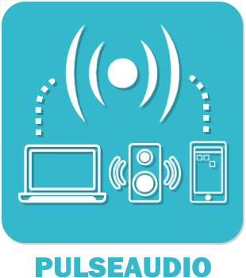

    

### Master:   

### Develop:   

# Présentation:

Plugin Jeedom/NextDom permettant la gestion du son via et vers des PC, enceintes Bluetooth, enceintes USB, sorties jack ...

# Documentation du plugin:
[Documentation principale](https://github.com/rjullien/plugin-PulseAudio/blob/develop/docs/fr_FR/index-PulseAudio.md)

# Documentation du plugin:

[présentation](docs/fr_FR/presentation.md) [configuration](docs/fr_FR/configuration.md) [faq](docs/fr_FR/faq.md) [changelog](docs/fr_FR/changelog.md)

# Documentation complète:

