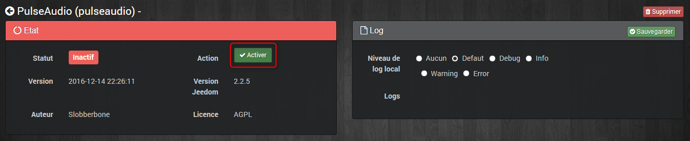
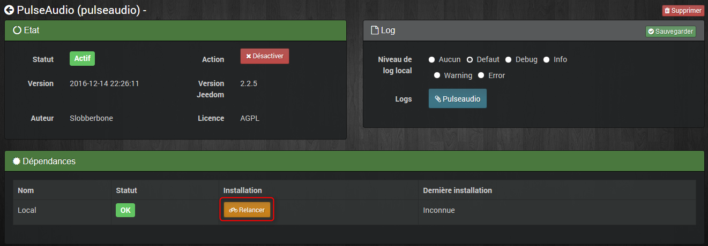
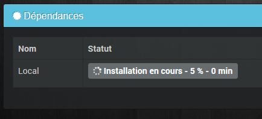
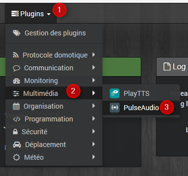
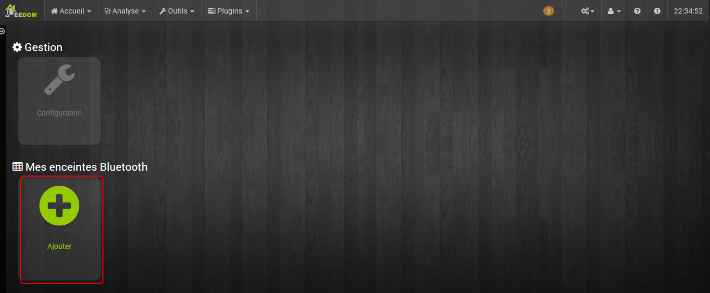
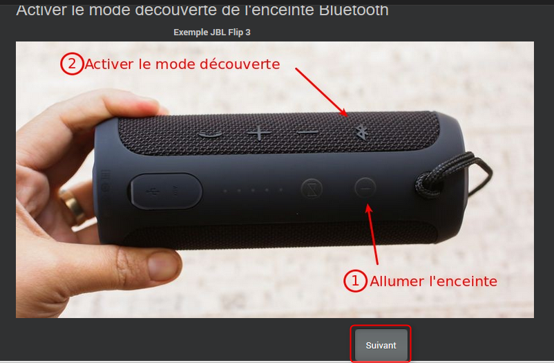
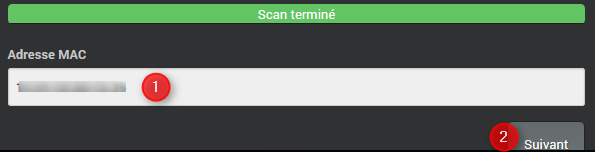
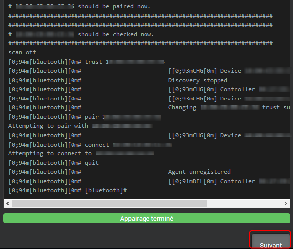
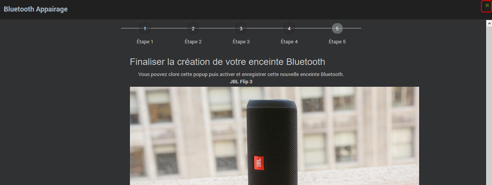

# Configuration

## Installation du plugin

Après téléchargement du plugin, il vous faudra simplement activer le
plugin :

Lancez l’installation des dépendances :

L’installation peut prendre du temps…

Une fois les dépendances installées, la date de la dernière installation
est inscrite :

Allez dans les logs puis vérifiez le log « pulseaudio\_dep » afin de
vérifier s’il y a des éventuelles erreurs

## Configuration du plugin

De retour dans la configuration du plugin Pulseaudio, dans la section
« Plugin PulseAudio », sélectionner le port de clé Bluetooth :

Enfin, sauvegardez les modifications.

# Configuration des équipements

Pour accéder à la configuration des équipements PulseAudio, aller dans
l’onglet « Plugins », « Multimédia » puis « PulseAudio » :

Cliquez sur « Ajouter » pour ajouter une enceinte Bluetooth :

Ajoutez un nom à votre équipement :

Renseignez les différents champs :

  - **Nom de l’enceinte Bluetooth** : le nom de votre équipement

  - **Objet parent** : indique l’objet parent auquel appartient
    l’équipement

  - **Port clé Bluetooth** : sélection du port de votre émetteur
    Bluetooth utilisé pour ce profil

  - **Catégorie** : les catégories de l’équipement

  - **Commentaire** : perme d’ajouter un commentaire

  - **Activer** : permet de rendre votre équipement actif

Cliquez sur l’assistant d’appairage :

Cliquez sur le bouton « suivant » :

L’assistant scanne les périphériques Bluetooth situés aux alentours de
votre box Jeedom :

Entez l’adresse MAC de votre enceinte Bluetooth, puis cliquez sur
« suivant » :

L’assistant connecte votre enceinte Bluetooth à Jeedom :

Une fois terminé, cliquez sur « suivant » .

Entrez un nom de service.

**ATTENTION** : il ne faut aucun espace ou caractère spécial dans ce nom
de service

Cliquez sur « suivant » une fois terminé :

Fermez l’assistant :

L’adresse MAC de votre enceinte Bluetooth et le nom du service associé
sont renseignés :

Activez, puis Enregistrez l’équipement :

