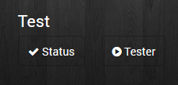
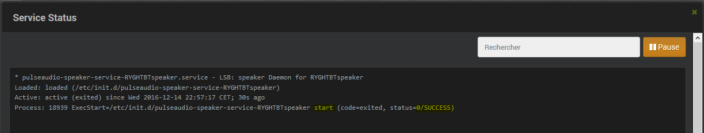

# FAQ

### Comment vérifier le status de mon service associé à mon enceinte ?

Cliquez sur le bouton « Status » :

Vérifier le statut du service. Celui-ci doit être démarré (start) avec
succès (SUCCESS) :

### Comment tester l’envoi d’un fichier son à mon enceinte ?

Cliquez sur le bouton « Tester » :

La lecture d’un fichier audio de test démarre. Le son sort de votre
enceinte Bluetooth.

Pour arrêter le test, cliquez sur « Arrêter le test ». Le processus de
lecture est stoppé.

### Comment régler le volume de mes sorties son ?

Allez dans la configuration du plugin Pulseaudio, dans la section
« Plugin PulseAudio » :

**Le volume de votre enceinte peut être réglé. Vous pouvez aussi cocher
les sorties audios à désactiver**

### Je n’ai pas de son \!\!\!.**

Pensez à vérifier tous les logs afin de détecter un éventuel problème 

